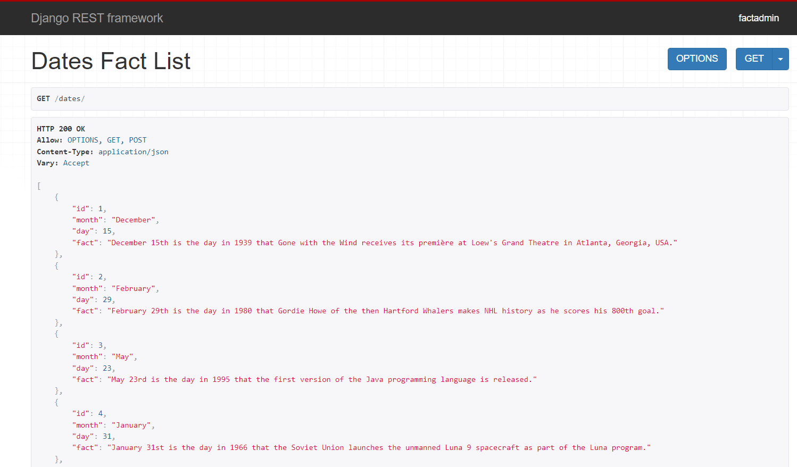

# Table of Contents
    * General Info
    * Techonologies
    * Setup

## General Info

 The Dates Fact Project is simple REST APIs using Django Framework.
It has a basic Database Interacting With an Eternal API inorder to store 
an interacting Fact about that specific day and month.

## Technologies
    
   - The Dates Fact Project is Build using
        * Python 
        * Django
        * Sqlite3
        * Django Rest Framework
        * Docker
        * Pytest

   - I use Python as a main programming language , Django Framework and Third Party 
 Django REST Framework to build the project.Although I recommend
 Postgresql for Big project, I found sqlite3 is enough for this lightweight project
 as a mater of fact it is the default database for Django.
   - The Project is also containerize using docker so that we can build it easily in your 
 local environment using docker-compose up --build command after you clone
 the project to your local environment.
   - pytest for Testing and developing the unit test it has great
 structure and fixture support to speed up the development process and
 easily debug the failed tests with nice summery.

##  Setup
 To run the project
    
     - git clone https://github.com/Eyobkibret15/dates_fact.git
    
    - set the environmental variable or assign in django settings file
          * DEBUG
          * ALLOWED_HOSTS
          * SECRET_KEY

    - docker-compose up --build to launch in docker 
               OR
    - create virtualenv
    - migrate the database
    - runserver

### Examples of use
   

 

 